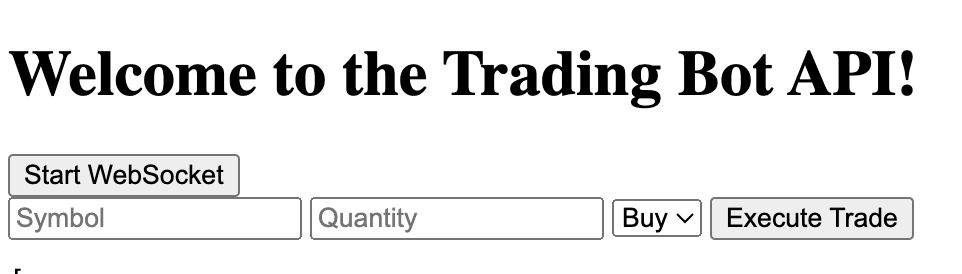

# 📡 algo-bot – Real-Time Trading Assistant

A real-time trading assistant built with Flask and Python that connects to the Alpaca Markets API to execute live trades, respond to price movements, and receive TradingView alerts via webhooks.

---

## 🚀 Features

- 🔄 **Real-Time Data via WebSocket** (Alpaca IEX)
- 🛒 **Market Order Execution** via Alpaca Trading API
- 🧠 **Trade Triggers Based on Price Movement**
- 📤 **Webhook Endpoint for TradingView Alerts**
- 🧵 **Multithreaded WebSocket Handling**
- 📋 **JSON-Formatted Order Logs for Easy Auditing**

---

## 🧱 Tech Stack

| Tool         | Purpose                             |
|--------------|-------------------------------------|
| Python       | Core programming language           |
| Flask        | Web server and API routing          |
| Alpaca API   | Trading and market data             |
| WebSocketApp | Real-time data stream               |
| HTML/Jinja2  | Frontend rendering (basic)          |
| threading    | Concurrent WebSocket execution      |

---

## ⚙️ API & Webhook Endpoints

### `POST /trade`
Manually submit a trade order:

```bash
curl -X POST http://localhost:5000/trade -d "symbol=AAPL&qty=1&side=buy"
```

### `POST /webhook`
Handle alerts from TradingView or external systems:

```json
{
  "symbol": "AAPL",
  "side": "buy",
  "qty": 1
}
```

---

## 🧪 Strategy Logic (Example)
If `QBTS` price drops more than $0.05 compared to last recorded trade price → trigger a market **buy**.

---

## 📂 Project Structure

```
algo-bot/
├── app.py               # Flask + Alpaca integration
├── templates/           # HTML templates (index, response, webhook)
├── static/              # Optional for CSS/JS
├── requirements.txt     # Dependencies
```

---

## 🔒 Security Note
Do **NOT** commit your Alpaca API credentials. Use environment variables or a secrets manager in production.

---

## 🎓 Educational Use
This project was built by [Asmaa Abdul-Amin](https://asmaa.dev) as part of her Data Science B.S. program at UMGC. It demonstrates skills aligned with **Quant Developer** roles, including:

- Real-time data ingestion
- RESTful API integration
- Conditional logic for trade execution
- Logging and data serialization

---

## 🧠 Author

**Asmaa Abdul-Amin**  
🔗 [Portfolio](https://asmaa.dev)  
🐙 [GitHub](https://github.com/blkpvnthr)  
💼 [LinkedIn](https://linkedin.com/in/blkpvnthr)

---

> ⚠️ This project is for educational use only. It does not constitute financial advice or real trading recommendations.
